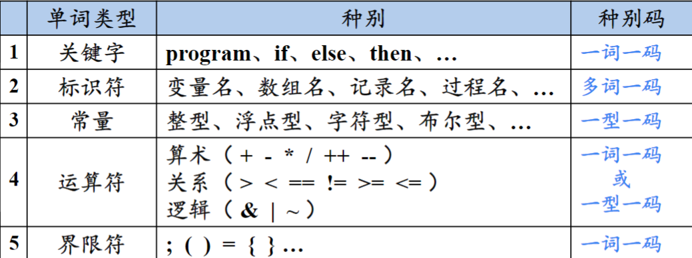
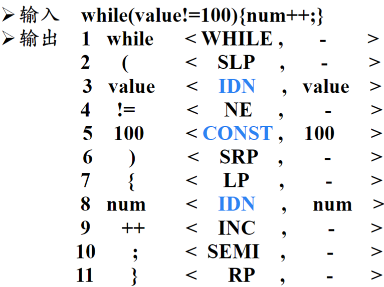
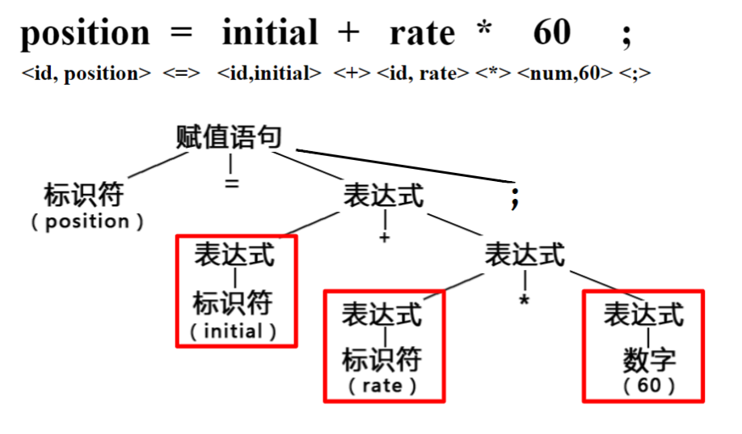
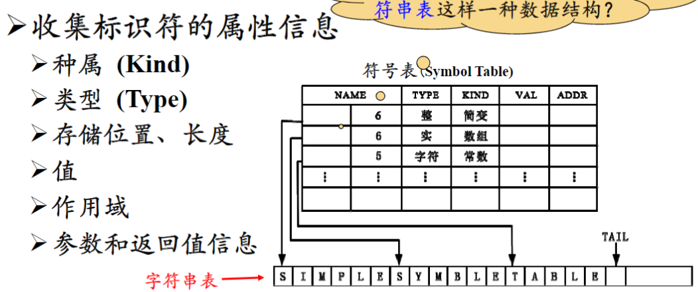

# 1.1 什么是编译

## 计算机程序设计语言及编译

1. 高级语言：类似于数学定义或自然语言的简洁形式。

    特点：接近人类的表达习惯；不依赖于特定机器；编写效率高。

2. 汇编语言：引入了注记符号，如`MOV`。

    特点：依赖于特定的机器；编写效率相对仍然很低。

3. 机器语言：可以被计算机直接理解的语言。
    
    特点：与人类表达习惯相差甚远，难以记忆编写阅读。  

编译：将**高级语言**（源语言）翻译成为**汇编语言**或者**机器语言**（两者统称为目标语言）的过程。

汇编：将汇编语言汇编成为机器语言的过程。

## 编译器在语言处理系统中的位置

语言处理系统的构成：

源程序 -> 预处理器(Preprocessor) -> **编译器** -> 汇编器 -> 链接器(Linker)/加载器(Loader)

具体步骤：

1. 预处理器把不同文件中的源程序聚合在一起；把称为宏的缩写语句转化为原始语句。
2. 经过预处理的源程序通过编译器转化为汇编语言程序。
3. 汇编语言程序通过汇编器被翻译成**可以重定位的机器代码**。
4. 加载器的作用：修改可重定位的地址；将修改后的指令和数据放到内存的适当位置。
5. 链接器的作用：将多个可重定位的代码文件组合到一起；解决**外部内存地址**问题。

可重定位机器码的含义：机器代码的起始位置不固定，其中的代码位置都是相对于起始位置的相对地址。例如：代码某个语句要求跳转到地址180，180是相对于代码起始位置的逻辑地址，若加载器给起始位置分配的物理地址是2000，那么这个跳转语句将会跳转到物理地址2180的位置。

外部内存地址问题：一个文件的代码引用另一个文件的数据对象或过程。

# 1.2 编译系统的结构

编译过程大体上可以分为两个步骤，首先是分析源语言句子所表达的含义（生成中间语言），这一部分被称之为前端(front-end)；第二个步骤是将中间语言翻译成为目标语言，这部分被称之为后端(back-end)。

## 分析部分(front-end)

1. 词法分析。如同翻译英语一样，首先找到一个句子里面所有单词对应的词性。
2. 语法分析。根据单词的词性，按照语法规则组成句子的结构。
3. 语义分析。根据句子的结构，分析出句子意义。（如英文翻译中文，已知各个短语代表的句子成分，就可以依照主谓宾的方式分析出谁在什么地方做了什么事情这一语义。）

编译器通过以上的分析步骤得到中间代码。

## 综合部分(back-end)

利用中间代码生成目标语言代码，在具体生成的前后都存在代码的优化。

# 1.3 词法分析概述

词法分析的任务：从左至右扫描源程序的字符，识别出各个单词，确定单词的类型，将识别的单词转化为词法单元(**token**)。

**token**：<种别码，属性值>

例子：

# 1.4 语法分析概述

语法分析(**parsing**)的任务：从词法分析输出的**token**序列中识别出各类短语，并构造语法分析树(parse tree)

例子：

# 1.5 语义分析概述

语义分析的主要任务：

1. 收集标识符的属性信息，根据属性信息构建符号表。

符号表中用字符串表这一数据结构来保存变量名，符号表保留每个变量名在字符串表中的首地址和长度。这一数据结构的作用：不必划分特定长度的空间用于存储字符串，节省存储空间便于管理

2. 语义检查。包括：未声明就使用语句；重复声明；运算类型不匹配等等。

# 1.6 中间代码生成及编译器后端概述

